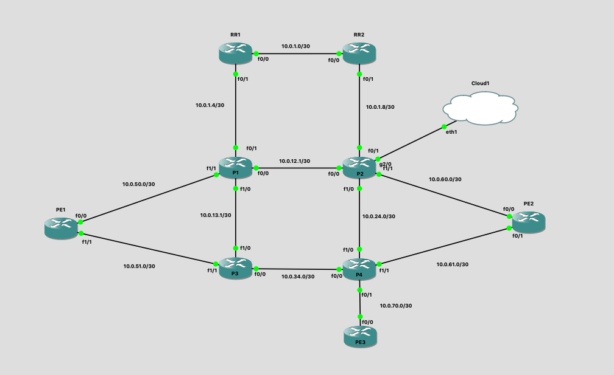

# Ansible L2VPN Deployment playbook

This repo contains a playbooks that I've used to deploy L2VPN services between PE nodes in the GNS3 topology below.

## Variables structure

This playbook uses a simple variable structure with 3 different key value pairs:
- interface
- vlanId
- peer

`interface` specifies the local interface to configure

`vlanId` specifies the vlan id to use for the subinterface encapsulation and it is also used as the vc-id for the xconnect configuration.

`peer` specifies the remote end of the l2vpn.

## Playbook structure

`provision_l2vpn_services.yaml` contains tasks to either generate local config files without pushing to the devices, pushing the generated configs to the devices, as well as doing both tasks together.